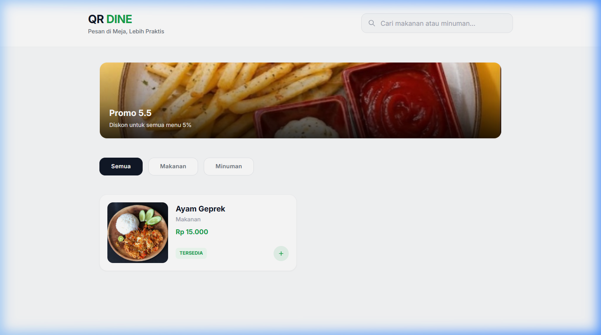
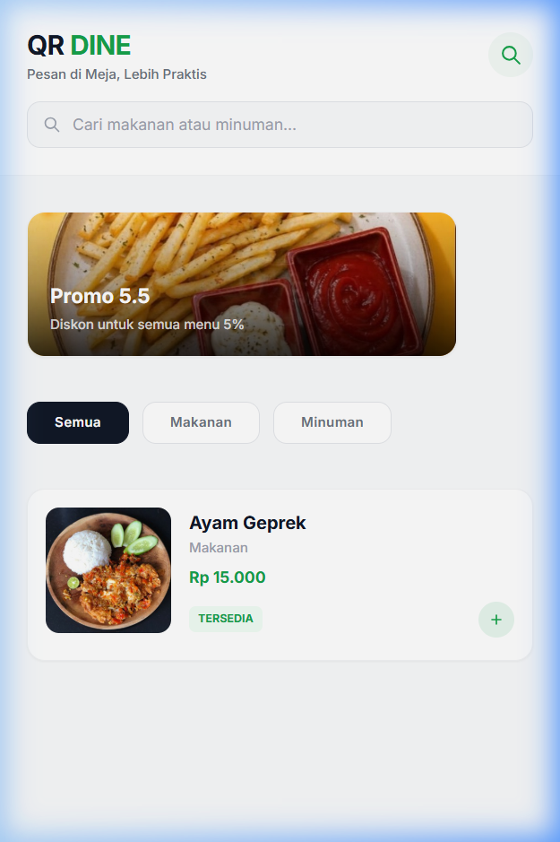
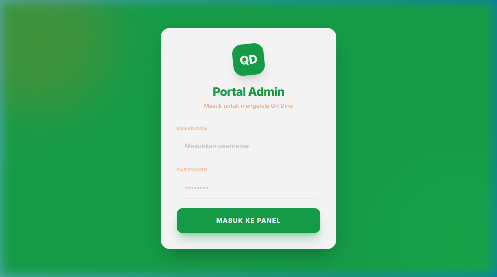
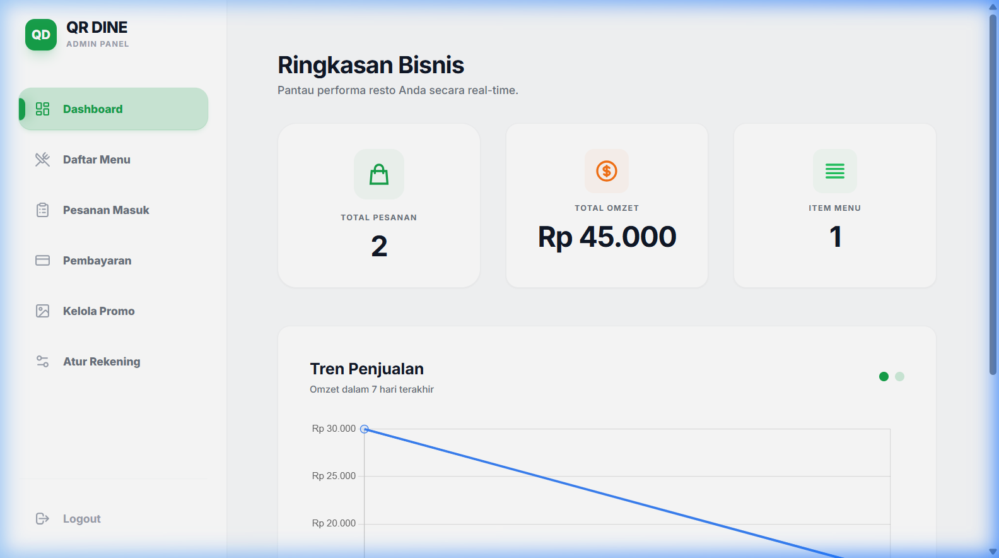
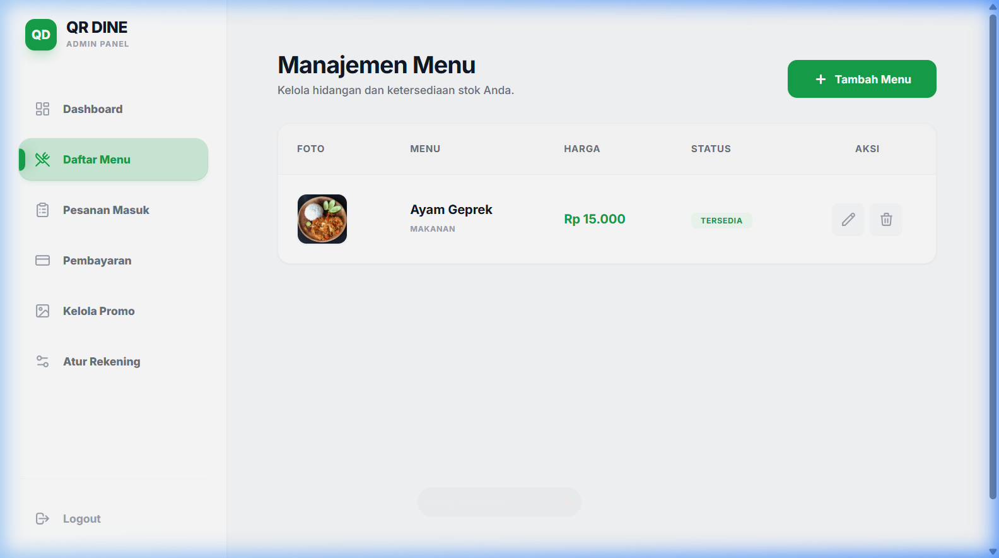

<div align="center">

# 🍽️ QR DINE

### Sistem Pemesanan Makanan Digital Berbasis QR Code

*Solusi modern untuk restoran & kafe — pesan langsung dari meja, tanpa kerumitan.*

[](https://vuejs.org/)
[](https://vitejs.dev/)
[](https://tailwindcss.com/)
[](https://codeigniter.com/)

</div>

---

## 📖 Tentang Proyek

**QR Dine** adalah aplikasi web pemesanan makanan berbasis QR Code yang dirancang untuk restoran dan kafe modern. Pelanggan cukup memindai QR code di meja masing-masing untuk mengakses menu digital, melakukan pemesanan, dan menyelesaikan pembayaran — **tanpa perlu memanggil pelayan atau antri di kasir**.

Proyek ini terdiri dari dua sisi:
- **Frontend (Vue.js)** — Antarmuka pelanggan & panel admin yang responsif dan modern
- **Backend (CodeIgniter 4)** — REST API untuk manajemen data, pesanan, dan pembayaran
- **Realtime Server (Node.js + Socket.IO)** — Notifikasi pesanan baru secara *real-time* ke dapur/admin

> Repositori ini adalah **Frontend (FE)** dari keseluruhan sistem QR Dine.

---

## 🖼️ Tampilan Aplikasi

### Halaman Menu Pelanggan (Desktop)


### Halaman Menu Pelanggan (Mobile)
<div align="center">
  
</div>

### Portal Login Admin


### Dashboard Admin — Ringkasan Bisnis


### Panel Admin — Manajemen Menu


---

## ⚙️ Teknologi yang Digunakan

| Kategori | Teknologi | Keterangan |
|---|---|---|
| **Framework UI** | [Vue.js 3](https://vuejs.org/) | Composition API dengan `<script setup>` |
| **Build Tool** | [Vite 8](https://vitejs.dev/) | Build & dev server yang sangat cepat |
| **Styling** | [Tailwind CSS 3](https://tailwindcss.com/) | Utility-first CSS framework |
| **Routing** | [Vue Router 4](https://router.vuejs.org/) | Client-side routing SPA |
| **HTTP Client** | [Axios](https://axios-http.com/) | Komunikasi dengan REST API backend |
| **Realtime** | [Socket.IO Client](https://socket.io/) | Notifikasi pesanan baru secara live |
| **Charts** | [Vue ChartJS](https://vue-chartjs.org/) | Grafik tren penjualan di dashboard |
| **Notifikasi** | [SweetAlert2](https://sweetalert2.github.io/) | Pop-up notifikasi yang elegan |
| **Ikon** | [Lucide Vue Next](https://lucide.dev/) | Library ikon SVG modern |
| **Font** | [Inter](https://fonts.google.com/specimen/Inter) | Tipografi modern standar industri |

### Palet Warna Sistem

```js
// tailwind.config.js
colors: {
  primary:       "#16A34A",  // Hijau — warna aksi utama
  "primary-dark": "#15803d", // Hijau gelap — hover state
  secondary:     "#F97316",  // Oranye — aksen & highlight
  accent:        "#22C55E",  // Hijau terang — status aktif
  warm:          "#F9FAFB",  // Abu sangat muda — latar halaman
}
```

---

## 📁 Struktur Proyek

```
FE/
├── docs/                         # Aset dokumentasi (screenshot)
├── public/                       # File statis (favicon, audio notif)
│   └── notif.mp3
├── src/
│   ├── assets/                   # Gambar & aset statis
│   ├── components/               # Komponen Vue yang dapat digunakan ulang
│   ├── router/
│   │   └── index.js              # Konfigurasi routing aplikasi
│   ├── services/
│   │   └── api.js                # Konfigurasi Axios instance
│   ├── store/
│   │   └── cart.js               # State management keranjang (reactive)
│   ├── utils/
│   │   └── swal.js               # Helper SweetAlert2
│   └── views/
│       ├── MenuPage.vue          # Halaman utama menu pelanggan
│       ├── CartPage.vue          # Halaman keranjang belanja
│       ├── CheckoutPage.vue      # Konfirmasi & checkout pesanan
│       ├── OrderStatus.vue       # Lacak status pesanan
│       ├── UploadPayment.vue     # Upload bukti transfer
│       ├── LoginPage.vue         # Login portal admin
│       └── admin/
│           ├── AdminPage.vue     # Layout wrapper admin (sidebar)
│           ├── Dashboard.vue     # Ringkasan & statistik bisnis
│           ├── MenuAdmin.vue     # CRUD manajemen daftar menu
│           ├── OrderAdmin.vue    # Monitor pesanan masuk
│           ├── PaymentAdmin.vue  # Verifikasi bukti pembayaran
│           ├── PromoAdmin.vue    # CRUD banner promo
│           └── PaymentSettings.vue # Pengaturan rekening bank
├── index.html
├── package.json
├── tailwind.config.js
└── vite.config.js
```

---

## 👤 Fitur Sisi Pelanggan

### 1. 📋 Halaman Menu (`/`)
- Menampilkan **banner promo dinamis** yang dapat di-slideshow secara otomatis
- **Filter kategori** menu berdasarkan kategori (Semua, Makanan, Minuman, dll.)
- **Pencarian real-time** — ketik nama menu, daftar langsung tersaring tanpa reload
- Tampilan kartu menu dengan foto, nama, harga, dan status ketersediaan
- Tombol `+` untuk menambahkan item ke keranjang secara instan
- **Floating button** keranjang yang menampilkan jumlah item & total harga
- Tampilan sepenuhnya **responsif** untuk mobile dan desktop

### 2. 🛒 Keranjang Belanja (`/cart`)
- Daftar item yang sudah ditambahkan beserta subtotal masing-masing
- Tombol `+` / `−` untuk mengubah jumlah item
- Tombol hapus per item
- Menampilkan **total keseluruhan** secara dinamis
- Tombol lanjut ke **Checkout**

### 3. 💳 Checkout & Pemesanan (`/checkout`)
- Ringkasan detail semua item yang dipesan
- **Input nomor meja** — wajib diisi sebelum memesan
- Pilihan metode pembayaran:
  - **Bayar Tunai (COD)** — bayar langsung ke kasir
  - **Transfer Bank** — dengan info rekening yang muncul otomatis
- Tombol salin nomor rekening dengan satu klik
- Proses pemesanan dikirim ke backend via API

### 4. 📤 Upload Bukti Pembayaran (`/upload-payment`)
- Form upload foto/screenshot bukti transfer
- Preview gambar sebelum dikirim
- Status loading saat proses upload berlangsung

### 5. 📡 Status Pesanan (`/status`)
- Menampilkan kode unik pesanan
- Status order dan status pembayaran secara real-time
- Indikator visual berwarna sesuai status:
  - 🟡 **Menunggu** — bukti sedang diverifikasi admin
  - 🟢 **Lunas** — pembayaran disetujui, pesanan diproses
  - 🔴 **Ditolak** — bukti ditolak, dilengkapi tombol upload ulang
- Tombol upload ulang jika bukti pembayaran ditolak
- Tombol kembali ke halaman menu

---

## 🔐 Fitur Panel Admin

Akses melalui `/login` → diarahkan ke `/admin`

### 1. 📊 Dashboard (`/admin/dashboard`)
- **Kartu statistik ringkasan**:
  - Total pesanan masuk
  - Total omzet (Rp)
  - Jumlah item menu yang terdaftar
- **Grafik tren penjualan** 7 hari terakhir (line chart interaktif)
- **Notifikasi real-time** — pop-up toast muncul otomatis + bunyi notifikasi saat ada pesanan baru (via Socket.IO)
- Semua data di-refresh otomatis saat ada event pesanan baru

### 2. 🍳 Manajemen Menu (`/admin/menu`)
- **Tabel daftar menu** dengan foto, nama, kategori, harga, dan status
- **Tambah menu baru** via modal form:
  - Nama menu
  - Kategori (Makanan / Minuman)
  - Harga
  - Deskripsi
  - Upload foto menu
  - Toggle status ketersediaan (Tersedia / Habis)
- **Edit menu** yang sudah ada
- **Hapus menu** dengan konfirmasi dialog
- Tabel responsif dengan scroll horizontal di mobile

### 3. 📋 Pesanan Masuk (`/admin/orders`)
- Daftar semua pesanan yang masuk secara chronologis
- Informasi per baris: waktu, kode pesanan, nomor meja, total, dan status pembayaran
- Badge warna untuk status pembayaran (Menunggu / Lunas / Ditolak / Belum Bayar)
- Tombol **Refresh** untuk memperbarui data
- Update otomatis via Socket.IO saat ada pesanan baru

### 4. ✅ Verifikasi Pembayaran (`/admin/payment`)
- Daftar pesanan yang sudah mengirim bukti transfer
- Thumbnail foto bukti pembayaran — klik untuk zoom dalam modal
- Tombol **Approve** (menyetujui) dan **Reject** (menolak) per pesanan
- Konfirmasi dialog sebelum aksi dieksekusi
- Status badge real-time setelah verifikasi
- Tombol dinonaktifkan jika belum ada bukti atau sudah diproses

### 5. 🎉 Kelola Promo (`/admin/promo`)
- **Tabel daftar banner promo** dengan preview gambar, judul, dan status
- **Tambah promo baru** via modal:
  - Judul promo
  - Deskripsi singkat
  - Upload gambar banner (format rasio 2:1 direkomendasikan)
  - Toggle status publikasi (Aktif / Tidak Aktif)
- **Edit dan hapus** promo yang ada
- Hanya promo dengan status **Aktif** yang muncul di halaman menu pelanggan

### 6. 💰 Atur Rekening (`/admin/payment-settings`)
- Form pengaturan rekening bank untuk pembayaran transfer
- Input: nama bank, nomor rekening, nama pemilik rekening
- Data rekening ini otomatis muncul di halaman checkout pelanggan saat memilih Transfer Bank
- Simpan perubahan dengan konfirmasi

---

## 🚀 Cara Menjalankan

### Prasyarat
- Node.js >= 18
- Backend QR Dine (CodeIgniter 4) berjalan di `http://localhost:8080`
- Realtime Server (Node.js) berjalan di `http://localhost:3000`

### Instalasi

```bash
# Clone repositori (jika belum)
git clone <url-repo>

# Masuk ke folder FE
cd FE

# Install dependencies
npm install

# Jalankan development server
npm run dev
```

Aplikasi akan berjalan di **http://localhost:5173**

### Build untuk Produksi

```bash
npm run build
```

Output build akan berada di folder `dist/`.

---

## 🔗 Koneksi Backend

Konfigurasi URL backend ada di `src/services/api.js`:

```js
import axios from 'axios'

const api = axios.create({
  baseURL: 'http://localhost:8080/api',
})

export default api
```

Ubah `baseURL` sesuai URL server backend Anda di lingkungan produksi.

---

## 📱 Responsivitas

QR Dine didesain dengan pendekatan **mobile-first**:

| Breakpoint | Keterangan |
|---|---|
| `< 768px` | Tampilan mobile — sidebar admin tersembunyi, akses via hamburger menu |
| `≥ 768px` | Tampilan tablet/desktop — sidebar admin selalu tampil |

Semua tabel di panel admin menggunakan `overflow-x-auto` sehingga dapat di-scroll horizontal di layar kecil tanpa merusak layout.

---

<div align="center">

Dibuat dengan ❤️ menggunakan **Vue.js** + **Tailwind CSS**

</div>
